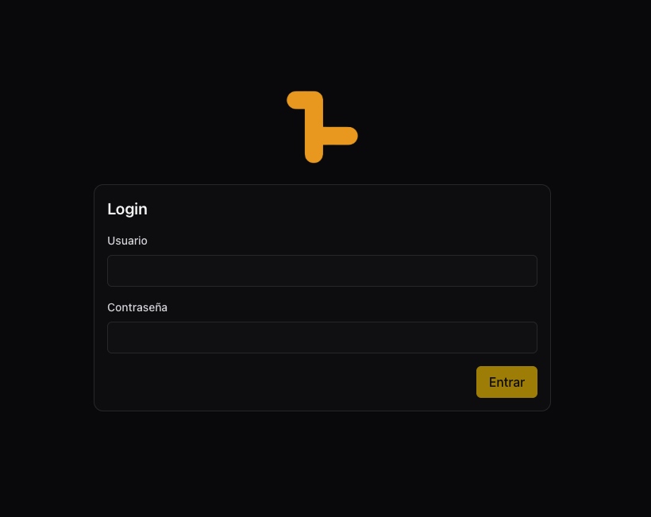
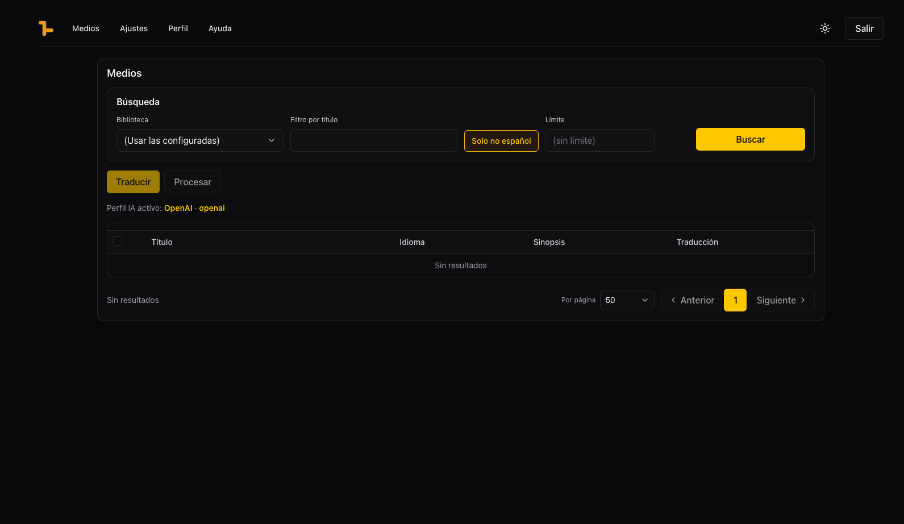
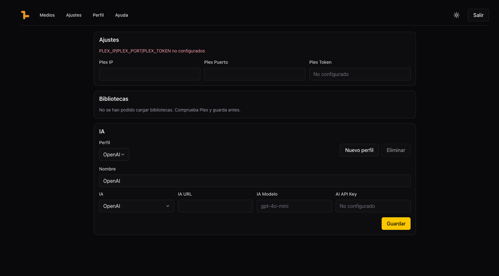

<p align="center">
  
</p>

# Plex Language Media Tool

Aplicación web para traducir automáticamente las sinopsis de tu servidor Plex al español usando inteligencia artificial.

---

## ¿Qué hace?

Conecta con tu instancia de Plex, detecta los medios cuya sinopsis no está en español y los traduce usando el proveedor de IA que elijas. Las traducciones se pueden revisar antes de escribirlas de vuelta en Plex.

El flujo de trabajo es:
1. **Buscar** — recupera los medios de Plex según los filtros aplicados
2. **Traducir** — envía las sinopsis seleccionadas al proveedor de IA
3. **Procesar** — escribe las traducciones aprobadas de vuelta en Plex

---

## Características

- Soporte para múltiples proveedores de IA: **OpenAI** (y APIs compatibles), **Ollama** (modelos locales) y **Google Translate** vía Deep Translator
- Gestión de perfiles de IA: crea varios perfiles y cambia entre ellos desde Ajustes
- Detección automática de idioma con lógica especial para español/catalán
- Filtro "Solo no español" para mostrar únicamente los candidatos a traducir
- Caché de páginas en sesión para navegación rápida sin repetir búsquedas
- Autenticación con JWT, cambio de usuario y contraseña desde la app
- Interfaz en modo claro/oscuro

---

## Capturas de pantalla

| Login | Medios | Ajustes |
|-------|--------|---------|
|  |  |  |

---

## Stack

| Capa | Tecnología |
|------|-----------|
| Backend | Python 3.12 · FastAPI · SQLite · plexapi |
| Frontend | Next.js 16 · Tailwind CSS v4 · shadcn/ui · TanStack Table |
| IA | OpenAI SDK · Ollama · deep-translator |
| Despliegue | Docker · Docker Compose |

---

## Instalación con Docker (recomendado)

### 1. Clonar el repositorio

```bash
git clone https://github.com/tu-usuario/plex-trans.git
cd plex-trans
```

### 2. Crear el archivo de variables de entorno

Crea un archivo `.env` en la raíz del proyecto:

```env
JWT_SECRET=cambia-esto-por-un-secreto-seguro
CORS_ORIGINS=http://tu-servidor-ip:3000
API_BASE_URL=http://tu-servidor-ip:8000
```

### 3. Construir y levantar los contenedores

```bash
docker-compose up --build -d
```

Esto levanta dos contenedores:
- `plex-trans-backend` — API en el puerto `8000`
- `plex-trans-frontend` — Interfaz web en el puerto `3000`

Accede a la app en `http://tu-servidor-ip:3000`

---

## Instalación en desarrollo

### Backend

```bash
# Crear entorno virtual e instalar dependencias
python -m venv .venv
source .venv/bin/activate
pip install -r requirements.txt

# Arrancar el servidor
APP_DB_PATH="./data/app.db" JWT_SECRET="dev-secret" CORS_ORIGINS="*" \
  .venv/bin/uvicorn backend.main:app --host 0.0.0.0 --port 8000 --reload
```

### Frontend

```bash
cd frontend
npm install

# Crear archivo de entorno local
echo "API_BASE_URL=http://localhost:8000" > .env.local

npm run dev
```

Accede a la app en `http://localhost:3000`

---

## Configuración inicial

Al acceder por primera vez la app detecta que no hay usuarios y muestra el formulario de registro. Crea tu usuario y entra.

### Ajustes de Plex

Ve a **Ajustes** e introduce:
- **Plex IP** — IP o hostname de tu servidor Plex
- **Plex Puerto** — por defecto `32400`
- **Plex Token** — token de autenticación de Plex (búscalo en las herramientas de red del navegador mientras usas Plex Web, cabecera `X-Plex-Token`)

Selecciona las **bibliotecas** que quieres incluir en las búsquedas.

### Configurar un perfil de IA

Desde **Ajustes** crea un perfil de traducción eligiendo uno de los tres proveedores:

| Proveedor | Requisitos | Notas |
|-----------|-----------|-------|
| **OpenAI** | URL base + API Key + modelo | Compatible con cualquier API OpenAI-compatible (LM Studio, OpenRouter, etc.) |
| **Ollama** | URL de la instancia + modelo | Modelos locales, sin coste externo |
| **Deep Translator** | Ninguno | Google Translate gratuito, menor calidad |

---

## Variables de entorno

### Backend

| Variable | Por defecto | Descripción |
|----------|-------------|-------------|
| `JWT_SECRET` | _(requerido)_ | Clave para firmar los tokens JWT |
| `APP_DB_PATH` | `/data/app.db` | Ruta de la base de datos SQLite |
| `JWT_EXPIRES_MINUTES` | `10080` (7 días) | Duración del token |
| `CORS_ORIGINS` | `http://localhost:3000` | Orígenes CORS permitidos |
| `MEDIA_CACHE_TTL_SEC` | `300` | TTL de la caché de medios en memoria |

### Frontend

| Variable | Por defecto | Descripción |
|----------|-------------|-------------|
| `API_BASE_URL` | `http://localhost:8000` | URL del backend |

---

## Instalación en Unraid

### Opción 1 — Plantillas via SSH (recomendado)

Conecta por SSH a tu servidor Unraid y ejecuta los siguientes comandos para descargar las plantillas directamente:

```bash
curl -o /boot/config/plugins/dockerMan/templates-user/plex-trans-backend.xml \
  https://raw.githubusercontent.com/unraiders/plex-trans/main/unraid/plex-trans-backend.xml

curl -o /boot/config/plugins/dockerMan/templates-user/plex-trans-frontend.xml \
  https://raw.githubusercontent.com/unraiders/plex-trans/main/unraid/plex-trans-frontend.xml
```

Después ve a **Docker → Add Container** y las plantillas aparecerán en el desplegable de **Plantillas de usuario**.

Recuerda ajustar en cada plantilla:
- **Backend:** `JWT_SECRET` por una cadena segura y `CORS_ORIGINS` por la URL de tu frontend
- **Frontend:** `API_BASE_URL` por la IP y puerto de tu backend (ej: `http://192.168.1.100:8000`)

---

## Aviso importante

> **Haz una copia de seguridad de tu instancia de Plex antes de usar esta aplicación.**
> El botón **Procesar** escribe directamente en tu servidor Plex y esta acción no se puede deshacer desde la app.

---

## Licencia

MIT
